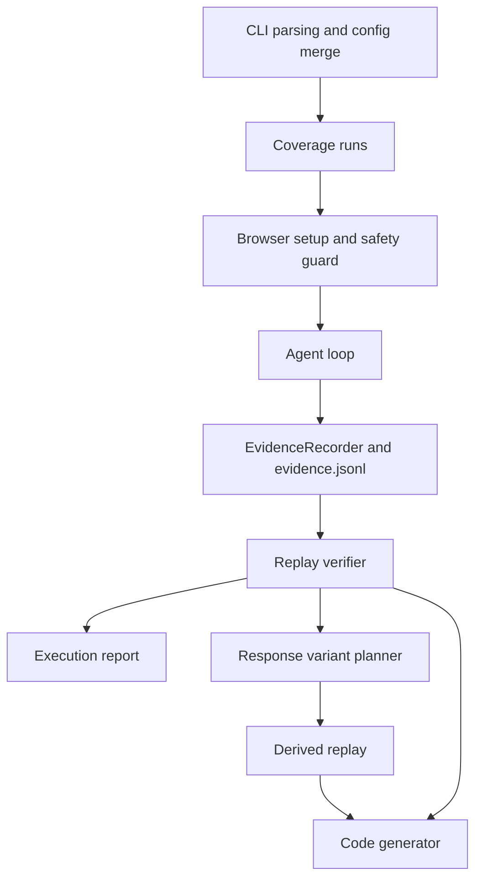

# Architecture

Appwalk is a deliberately small pipeline. Each stage has a distinct responsibility and produces data consumed by the next stage.



## Main boundaries

| Area | Responsibility |
| --- | --- |
| `src/cli/index.ts` | Parse commands, merge explicit config, create execution directories, orchestrate runs, and write artifacts. |
| `src/config.ts` | Validate YAML and the flattened CLI/config result. |
| `src/agent/loop.ts` | Maintain one provider conversation and one browser exploration session per coverage run. |
| `src/agent/personas.ts` | Define built-in persona goals, intent, verification mode, and core actions. |
| `src/browser/*` | Execute browser actions, login, page observations, timeout setup, and browser lifecycle operations. |
| `src/evidence/*` | Record per-step browser evidence and read append-only JSONL safely. |
| `src/verify/replay.ts` | Re-execute successful actions without an LLM and compare the expected result, including whether a derived fixture source was actually observed. |
| `src/response/variants.ts` | Capture eligible JSON fixtures, parse conservative patches, install fixture queues, and report which selected fixture was applied during derived replay. |
| `src/report/contract.ts` | Build the structured report contract and render the human-facing HTML report. |
| `src/codegen/spec.ts` | Convert confirmed flows into Playwright test source. |
| `src/providers/*` | Adapt provider-specific tool calling, history, response parsing, and rate-limit metadata to one `LlmProvider` interface. |

## Context isolation

One `coverage` run owns one browser session and one provider conversation. Coverage runs are executed sequentially and are not merged into one LLM context. The aggregate report combines their results only after each run has completed.

Replay does not ask the LLM what to do next. It reads the successful tool calls from evidence and executes that fixed sequence in a clean session. This is the key boundary between exploration and verification.

## Evidence as the source for generation

The agent's narrative is useful for naming and explanation, but generated actions come from successful tool calls in the evidence stream. Failed exploratory actions are preserved for diagnostics and excluded from replay. A flow is eligible for generation only after replay confirmation, unless it is a challenge flow represented as a finding rather than regression coverage.

## Provider contract

Providers implement two operations:

```ts
start({ systemPrompt, tools, initialInput, screenshot? })
continue({ toolCallId, toolName, result, screenshot? })
```

The loop executes one tool call at a time. Provider adapters normalize the response to either a single `tool_call` or plain `text`, and log when a provider returns multiple tool calls. Plain text ends exploration; it does not create a synthetic flow.

## Page observation

Each browser result contains an accessibility tree from Playwright's `ariaSnapshot()` plus a bounded DOM-lite inventory of visible interactive elements and embedded frames. The accessibility tree is the primary semantic signal. The inventory supplies stable locator hints for applications that use non-semantic elements such as clickable `div`s; it deliberately excludes the full HTML document to keep provider context useful and bounded.

Locator selection follows this order: `data-testid`, stable `id` or app-owned attribute, role and accessible name, stable visible text, then a CSS structure selector. Screenshots remain an optional visual supplement rather than the primary page representation.

## Testing strategy

Appwalk's own tests are local and focused on contracts with a high regression risk:

- merged option validation;
- response occurrence tracking and variant patching;
- normal, verbose, and debug logging with redaction;
- the agent loop's behavior when a provider ends with plain text.

Generated application tests are a separate artifact and are not a substitute for tests of Appwalk itself.

Response variant confirmation is causal: a UI expectation that happens to be true before the mocked
request is made cannot confirm the variant. The replay installs fixtures before navigation, records the
selected `method + URL + occurrence`, and evaluates the derived expectation only after that response is
applied. When the source response is not observed, the scenario is skipped with a diagnostic reason.
