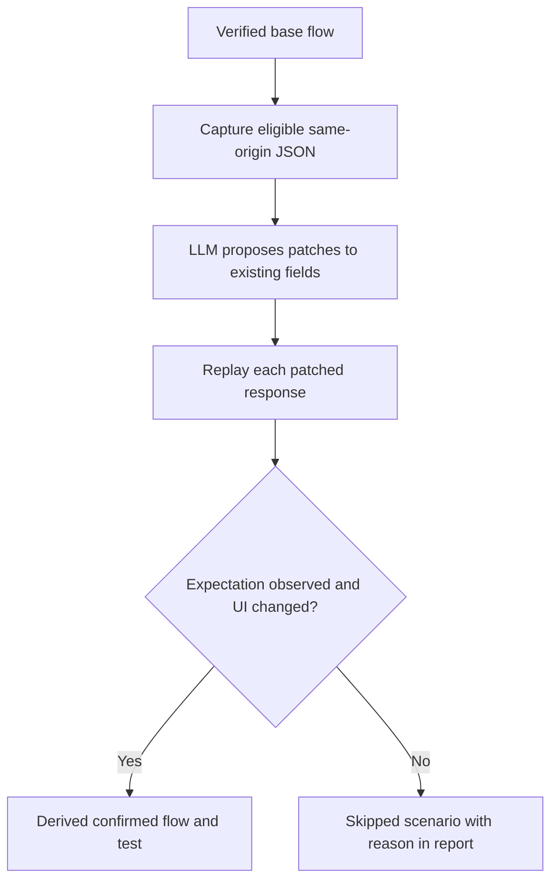

# Personas and exploration

Appwalk separates *what the agent is looking for* from *where it is looking*:

```text
persona  = behavior and risk lens
scope    = area or objective to explore
expect   = conditions that should hold inside that scope
```

## Persona intent

Every built-in persona has one of two intents:

| Intent | Purpose | How the result is treated |
| --- | --- | --- |
| `journey` | Exercise a normal user journey and verify that it completes or remains usable. | A flow must pass discovery and replay verification before it becomes regression coverage. |
| `challenge` | Deliberately exercise a boundary, failure, security, or resilience condition. | A replayed unmet condition can become a confirmed finding; a failed replay is inconclusive rather than a bug. |

## Built-in personas

| Name | Intent | Focus |
| --- | --- | --- |
| `freddie` | challenge | Invalid and malformed form values |
| `wade` | journey | Broad application navigation |
| `casey` | journey | Cancellation and removal paths |
| `della` | challenge | Declined or rejected operations |
| `blake` | journey | Backtracking and state preservation |
| `riley` | challenge | Rapid repeated actions |
| `owen` | challenge | Access from an outside or signed-out context |
| `iris` | challenge | Identifier and authorization boundaries |
| `dana` | challenge | Duplicate creation or submission |
| `gabe` | challenge | Failure injection and recovery |
| `kai` | journey | Keyboard-oriented interaction |
| `noah` | journey | Navigation and URL transitions |
| `tara` | journey | Forms and validation completion |
| `priya` | journey | International text and locale formats |
| `uma` | challenge | File upload validation |
| `max` | journey | Large but legitimate values and data-heavy states |
| `eli` | journey | Expired or stale state |
| `mia` | journey | Primary mobile baseline |
| `lena` | journey | Latency and slow network behavior |
| `hana` | journey | Hoverless and touch/keyboard alternatives |
| `rosa` | journey | Returning-user state and retained history |
| `ezra` | journey | File downloads and export controls |
| `gail` | challenge | Plan, trial, and quota entitlement boundaries |
| `talia` | challenge | Lost-update conflicts between two open tabs |

The persona list is intentionally finite and explicit. A target application does not need to support every persona; a persona should adapt to the application and report when its defining surface does not exist instead of inventing one.

## Scope

Scope is a guide, not a hard URL allowlist. It can point the agent at a feature, section, screen, or business objective without requiring the caller to know the exact route:

```bash
--scope "Explore product browsing, cart, checkout, and order history"
```

This is useful when the route structure is unknown or when several pages make up one feature. Use a URL directly when a known starting point is more useful than a broad objective.

## Expectations

Expectations are attached to a scope and can be repeated:

```bash
--scope "Explore account settings"
--expect "The saved preference is visible after returning to settings"
--expect "The user can leave settings without losing the selected value"
```

An expectation is not a standalone login or journey command. It is a condition Appwalk checks after the current flow has actually performed the behavior described by the expectation. A read-only page or a matching heading from an existing record does not prove that a create, submit, update, complete, or confirm operation happened. The report records whether each expectation was `met`, `violated`, or `unknown`, and where it was observed.

## Response scenarios

Response scenarios are optional derived flows. They are useful when a verified flow observes a meaningful JSON response with business-state fields such as order status, inventory, totals, or a collection. The CLI flag and config field call this a "variant" (`--response-variant-max`, `responses.maxVariants`); "scenario" and "variant" refer to the same thing throughout this documentation.

```bash
--response-variant-max 5
```

The process is conservative:



The planner does not invent response bodies, add fields, or use authentication responses. Repeated responses from the same method and URL are tracked by occurrence so the correct response in a sequence can be patched.
