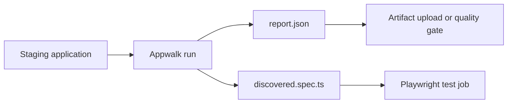

# Reports and artifacts

Every `run` and `explore` execution receives its own directory below the configured output root:

```text
appwalk-output/
  2026-08-27T09-42-18-291Z-8e2c4d91/
    report.html
    report.json
    discovery.json
    evidence.jsonl
    discovered.spec.ts       # only when run generated confirmed flows
```

The execution ID combines an ISO timestamp and a short random suffix. This keeps consecutive executions separate and makes a report easy to associate with the console output.

## Which file to open

| File | Audience | Purpose |
| --- | --- | --- |
| `report.html` | Tester, developer, reviewer | Human-facing execution result: personas, flows, replay state, findings, response scenarios, warnings, and recorded steps. |
| `report.json` | CI, dashboards, integrations | Stable structured execution contract with status, summary, runs, flows, findings, and artifact paths. |
| `discovery.json` | `generate`, tooling | Manifest of discovered flows, run metadata, replay state, captured storage, and response fixtures. |
| `evidence.jsonl` | Debugging and forensic review | Append-only per-step browser evidence, tool calls, results, network entries, console entries, and errors. |
| `discovered.spec.ts` | Playwright users | Generated tests for confirmed base and derived flows. |

## Report status

| Status | Meaning | Exit code |
| --- | --- | ---: |
| `passed` | At least one flow was replay-confirmed and no finding or execution error was recorded. | `0` |
| `findings` | A challenge flow was replayed and confirmed a potential application bug. | `1` |
| `failed` | An execution-level error prevented a complete run, such as a provider, browser, or replay setup failure. | `2` |
| `inconclusive` | No confirmed regression flow survived, evidence was incomplete, or a result could not be established. | `3` |

The console `status` is the execution status. A generated test suite can exist while the overall execution is `findings` or `inconclusive`; generation and application health are separate signals.

## Flow states

The report keeps discovery and replay separate because they answer different questions:

| State | Meaning |
| --- | --- |
| Discovery verified | The flow reached the persona's verification condition during the exploratory session. |
| Replay confirmed | The recorded actions reproduced the condition in a clean session. |
| Potential bug confirmed | A challenge persona reproduced its unmet expectation during clean replay. |
| Inconclusive | The flow or finding could not be replayed or evidence was incomplete. It is not proof of a bug. |
| Derived | The flow came from a response variant of a confirmed base flow. |

## Report interpretation

Read the report in this order:

1. **Execution status and summary**: decide whether the run passed, found a potential bug, failed, or needs review.
2. **Persona coverage**: see which independent exploration runs completed and which exhausted their action budget.
3. **Flows**: compare discovered flows with replay-confirmed flows. Unconfirmed discoveries are useful leads, not regression coverage.
4. **Findings**: inspect confirmed and inconclusive challenge results separately.
5. **Response scenarios**: review proposed, confirmed, and skipped variants with their reasons.
6. **Recorded steps and evidence**: use the exact action sequence and raw evidence when debugging.

## Evidence warnings

If a malformed JSONL record is encountered, the reader skips only that line and records an evidence warning. The report remains usable but becomes `inconclusive` unless a harder execution failure determines the status. This avoids presenting a partial evidence stream as complete.

## CI pattern

A typical CI pipeline keeps discovery and generated test execution as separate jobs:



Store the entire execution directory as a CI artifact. Use `report.json` for gates and `report.html` for human review. Do not treat `discovered.spec.ts` as trusted coverage until it has been reviewed and executed in the intended test environment.
