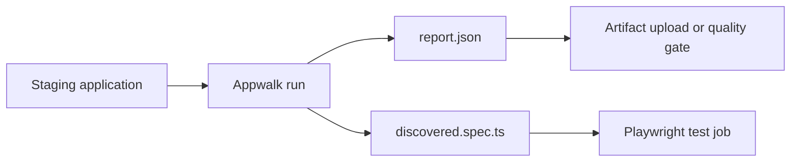

# Reports and artifacts

Every `run` and `explore` execution receives its own directory below the configured output root:

```text
appwalk-output/
  2026-08-27T09-42-18-291Z-8e2c4d91/
    report.html
    report.json
    discovery.json
    evidence.jsonl
    discovered.spec.ts       # only when run generated confirmed flows
    auth.ts                   # shared credential login helper, when credentials are used
    fixtures.ts               # shared response fixture loader, when response mocking is used
    fixtures/                 # baseline JSON and compact variant patch descriptors
```

The execution ID combines an ISO timestamp and a short random suffix. This keeps consecutive executions separate and makes a report easy to associate with the console output.

## Which file to open

| File | Audience | Purpose |
| --- | --- | --- |
| `report.html` | Tester, developer, reviewer | Human-facing execution result: personas, flows, replay state, findings, response scenarios, warnings, and recorded steps. |
| `report.json` | CI, dashboards, integrations | Stable structured execution contract with summary, runs, flow results, findings, and artifact paths. |
| `discovery.json` | `generate`, tooling | Manifest of discovered flows, run metadata, replay state, and response fixtures. It does not contain captured auth tokens. |
| `evidence.jsonl` | Debugging and forensic review | Append-only per-step browser evidence, tool calls, results, network entries, console entries, and errors. |
| `discovered.spec.ts` | Playwright users | Generated tests for confirmed base and derived flows. |
| `auth.ts` | Playwright users | Shared credential login helper used by generated tests when email/password login is configured. |
| `fixtures.ts` and `fixtures/` | Playwright users | Shared response replay helper, captured baseline JSON, and response-variant patch descriptors. |

## Exit codes

| Exit code | Meaning |
| --- | --- |
| `0` | Confirmed flow coverage exists without findings or incomplete evidence. |
| `1` | At least one flow contains a confirmed potential bug. |
| `2` | An execution-level error prevented the run from completing. |
| `3` | Coverage or evidence is incomplete, or no confirmed regression flow survived. |

Exit code is a process/CI signal only. The report does not assign a status to the execution or to a persona. Review status on individual flows, alongside the summary counts and coverage warnings. A generated test suite can exist while the exit code is `1` or `3`; generation and application health are separate signals.

## Flow states

The report uses three simple flow results. Discovery and replay remain supporting facts because they answer different questions. Runtime issues are observations, not a flow result; they are shown separately and do not change the flow result by themselves:

| Result | Meaning |
| --- | --- |
| Confirmed | Replay confirmed the flow. Runtime issues, when present, are shown separately on the flow. |
| Potential bug | Replay confirmed the flow and reproduced a finding that indicates a potential application bug. |
| Needs review | Replay did not confirm the flow, a finding was inconclusive, or the evidence was insufficient. The flow page includes the failed step, error, last URL, and last captured page state when an action failed. It is not proof of a bug. |

Supporting facts shown on a flow are:

- **Discovery verified**: the flow reached the persona's verification condition during exploration.
- **Replay confirmed**: the recorded actions reproduced the condition in a clean session.
- **Derived**: the flow came from a response variant of a confirmed base flow.

## Report interpretation

Read the report in this order:

1. **Summary**: see counts for personas, flows, replay confirmation, generated tests, findings, and coverage warnings.
2. **Persona coverage**: see which independent exploration runs completed, which exhausted their action budget, and whether safety limited the result.
3. **Flows**: review the status of each discovered or derived flow. Unconfirmed discoveries are useful leads, not regression coverage.
4. **Findings**: inspect confirmed and inconclusive challenge results separately.
5. **Response scenarios**: distinguish baseline fixtures used to stabilize the original flow from planner proposals and confirmed derived scenarios. Variants are shown beneath their baseline flow in the report navigation and flow order. A variant is confirmed only when its selected source response was actually applied during replay and its derived expectation was observed afterwards. Accepted, rejected, and skipped proposals are reported separately, so a planner that returned invalid patches is not presented as if it returned no scenarios.
6. **Runtime issues, recorded steps, and evidence**: review potential browser/application errors, then use the exact action sequence and raw evidence when debugging. Errors caused directly by a safety-blocked request are labeled as safety-related and are excluded from potential-bug review; navigation cancellations such as `ERR_ABORTED` are lifecycle noise and are excluded as well. The safety limitation itself still makes coverage inconclusive.

## Evidence warnings

If a malformed JSONL record is encountered, the reader skips only that line and records an evidence warning. The report remains usable but becomes `inconclusive` unless a harder execution failure determines the status. This avoids presenting a partial evidence stream as complete.

## CI pattern

A typical CI pipeline keeps discovery and generated test execution as separate jobs:



Store the entire execution directory as a CI artifact. Use `report.json` for gates and `report.html` for human review. Do not treat `discovered.spec.ts` as trusted coverage until it has been reviewed and executed in the intended test environment.
